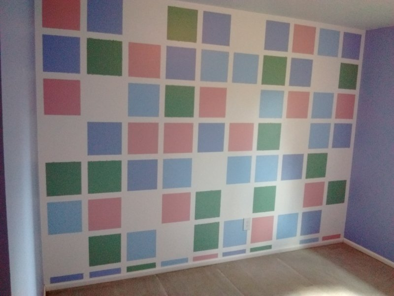

# Squares 2

## [squares2.colindt.net](https://squares2.colindt.net/)

A rewrite of [colindt.net/squares](https://colindt.net/squares/). Made with [React](https://reactjs.org/) and [React-Bootstrap](https://react-bootstrap.github.io/).

---

A few years ago my sister was planning to paint an accent wall with colored squares and asked me
if I could make a program to randomly generate patterns to see what they would look like. The
source code for the resulting web app that I made can be found [here](https://github.com/colindt/colindt.net/tree/master/squares).

The app was a success, and the wall turned out great, as seen here:

The original is pretty limited though. The colors and sizes of the wall and the squares are
hard-coded based on what was already chosen. So I decided to remake it with more options and
customizability using React as a vehicle for developing my skills.

See the in-app About page for usage details.
